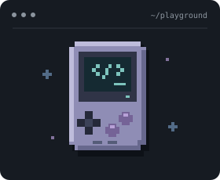

### Olá, eu sou o Luis Gustavo 👋

```console
luisgustavopk@github:~$ whoami
```

<table>
  <tr>
    <td width="34%" align="center" valign="middle">
      
    </td>
    <td width="66%" valign="middle">
      <p>Sou estudante de <strong>Engenharia de Software na PUC Minas</strong>, com foco em desenvolvimento web.</p>
      <pre><code>luisgustavopk@github
────────────────────────────
Foco       Backend &amp; Frontend
Local      Belo Horizonte, MG
Interesses Jogos, RPG e música</code></pre>
    </td>
  </tr>
</table>

<p align="center">
  <a href="https://luis-gustavo-portifolio.vercel.app/"></a>&nbsp;&nbsp;
  <a href="https://www.linkedin.com/in/luis-xavier-b71980356/"></a>&nbsp;&nbsp;
  <a href="mailto:luisgustavoxavier1234@gmail.com"></a>&nbsp;&nbsp;
  <a href="https://www.instagram.com/luisgustapk/"></a>&nbsp;&nbsp;
  <a href="https://x.com/lxpkS2"></a>&nbsp;&nbsp;
  <a href="https://discordapp.com/users/959151773728251914"></a>
</p>

### Linguagens e ferramentas

<p align="center">
  
</p>

### Estatísticas

<p align="center">
  
  
</p>

<details open>
  <summary> <b>Luis's Spotify Data</b></summary>
  <br />
  <!-- Os dois cards dependem de reconectar o Spotify aos respectivos serviços. -->
  <table>
    <tr>
      <td width="23%" align="center" valign="middle">
        <a href="https://open.spotify.com/user/utmmhfak3httdc40kx2u6qn2i"></a>
      </td>
      <td width="32%" align="center" valign="middle">
        
      </td>
      <td width="45%" align="center" valign="middle">
        
      </td>
    </tr>
  </table>
</details>
