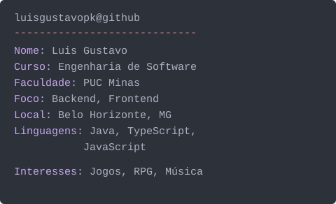

### Olá, eu sou o Luis Gustavo 👋

```console
luisgustavopk@github:~$ whoami
```

<table>
  <tr>
    <td width="34%" align="center" valign="middle">
      
    </td>
    <td width="66%" valign="middle">



</td>
</tr>
</table>

<p align="left">
  <a href="https://luis-gustavo-portifolio.vercel.app/"></a>&nbsp;&nbsp;
  <a href="https://www.linkedin.com/in/luis-xavier-b71980356/"></a>&nbsp;&nbsp;
  <a href="mailto:luisgustavoxavier1234@gmail.com"></a>&nbsp;&nbsp;
  <a href="https://www.instagram.com/luisgustapk/"></a>&nbsp;&nbsp;
  <a href="https://x.com/lxpkS2"></a>&nbsp;&nbsp;
  <a href="https://discordapp.com/users/959151773728251914"></a>
</p>
&nbsp;Linguagens e ferramentas:

<table>
  <tr>
    <td><b>Linguagens</b></td>
    <td></td>
  </tr>
  <tr>
    <td><b>Frameworks e dados</b></td>
    <td></td>
  </tr>
  <tr>
    <td><b>Ferramentas</b></td>
    <td></td>
  </tr>
</table>

GitHub Stats:

<p align="center">
  
  
</p>

<p align="center">
  <a href="https://wakatime.com/@Lxpk12"></a>
</p>

<details open>
  <summary> <b>Luis's Spotify Data</b></summary>
  <br />
  <table>
    <tr>
      <td width="55%" align="center" valign="middle">
        <a href="https://open.spotify.com/user/utmmhfak3httdc40kx2u6qn2i"></a>
      </td>
      <td width="45%" align="center" valign="middle">
        
      </td>
    </tr>
  </table>
</details>
