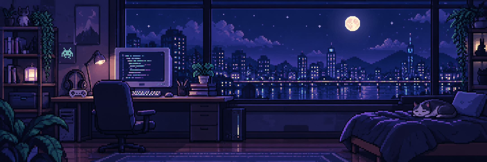



  

  <h1>Oi, eu sou o Luis Gustavo 👾</h1>

  

    Estudante de <strong>Engenharia de Software na PUC Minas</strong>. 
    Desenvolvimento web, curiosidade por IA e automações — e música entre um commit e outro.
  

  

    <a href="https://luis-gustavo-portifolio.vercel.app/">Portfólio</a> &nbsp; / &nbsp;
    <a href="https://www.linkedin.com/in/luis-xavier-b71980356/">LinkedIn</a> &nbsp; / &nbsp;
    <a href="mailto:luisgustavoxavier1234@gmail.com">E-mail</a>
  

   

  <h3><samp>01 / LINGUAGENS &amp; TECNOLOGIAS</samp></h3>

  

    <code>Java</code> &nbsp; <code>Spring Boot</code> &nbsp; <code>Node.js</code> &nbsp; <code>TypeScript</code> &nbsp; <code>JavaScript</code>
  

  

    <code>React</code> &nbsp; <code>HTML &amp; CSS</code> &nbsp; <code>MySQL</code> &nbsp; <code>MongoDB</code> &nbsp; <code>Git</code>
  

   

  <h3><samp>02 / GITHUB STATS</samp></h3>

  

    
    
  

  
<a href="https://github.com/Luisgustavopk?tab=overview">Contribuições</a> &nbsp; · &nbsp; <a href="https://wakatime.com/@Lxpk12">WakaTime</a>

   

  <h3><samp>03 / NO REPEAT</samp></h3>

  
  
<a href="https://open.spotify.com/user/utmmhfak3httdc40kx2u6qn2i">▶ Dá o play no meu Spotify</a>

   

  

    <a href="https://www.instagram.com/luisgustapk/">Instagram</a> &nbsp; · &nbsp;
    <a href="https://x.com/lxpkS2">X / Twitter</a> &nbsp; · &nbsp;
    <a href="https://discordapp.com/users/959151773728251914">Discord</a> &nbsp; · &nbsp;
    <a href="https://wa.me/5531982322845">WhatsApp</a>
  

  
<samp>save game. até o próximo commit.</samp>

